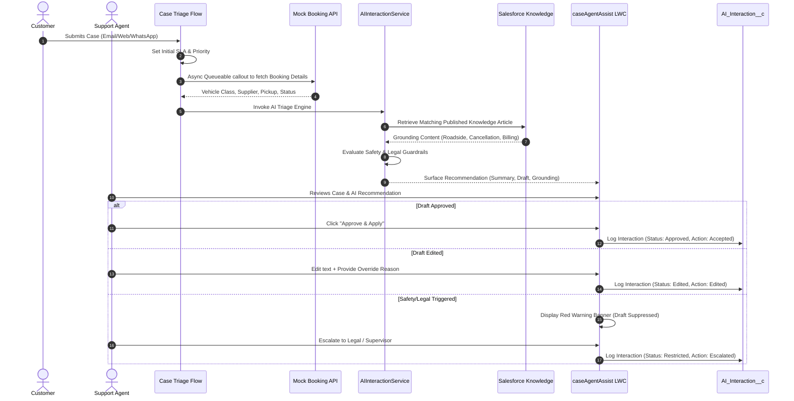

# 🚗 AI-Assisted Case Management System for Car Rental Operations

[-blue.svg)](https://developer.salesforce.com/)
[-brightgreen.svg)]()
[]()
[]()

> An enterprise-grade, **human-in-the-loop AI customer service platform** built on Salesforce Service Cloud. Orchestrates intent classification, urgent roadside triage, live booking API synchronization, deterministic refund calculations, Knowledge base grounding, and strict safety guardrails.

---

## 🌟 Executive Summary & Architectural Philosophy

Modern customer service teams handling car rental and travel operations face high ticket volumes, disparate booking systems, and stringent SLA demands (e.g., roadside vehicle breakdowns). While generative AI can accelerate response drafting, ungrounded Large Language Models risk hallucinating policies, quoting inaccurate refund figures, or mishandling legal threats.

This system solves this challenge by enforcing a strict **tri-tier separation of concerns**:

```
┌────────────────────────────────────────────────────────────────────────┐
│                        AI ASSISTANCE ENGINE                            │
│  • Intent Classification (Breakdown, Cancellation, Billing)            │
│  • Dynamic Urgency & Sentiment Scoring                                 │
│  • Draft Response Generation Grounded in Knowledge Base                │
└───────────────────────────────────┬────────────────────────────────────┘
                                    │
                                    ▼
┌────────────────────────────────────────────────────────────────────────┐
│                     DETERMINISTIC APEX & FLOW RULES                    │
│  • Tiered Refund Calculation (>48h = 100%, 24-48h = 50%, <24h = 0%)    │
│  • Guardrail Gate: Suppress drafts on Legal, Safety, Fraud keywords    │
│  • Asynchronous External Booking REST API Synchronization              │
└───────────────────────────────────┬────────────────────────────────────┘
                                    │
                                    ▼
┌────────────────────────────────────────────────────────────────────────┐
│                     HUMAN-IN-THE-LOOP AGENT CONSOLE                    │
│  • Lightning Web Component (LWC) with Real-Time Context                │
│  • 1-Click Approve, Edit with Override Reason, Reject, or Escalate     │
│  • Immutable Audit Trail Persisted to AI_Interaction__c                │
└────────────────────────────────────────────────────────────────────────┘
```

---

## 🏗️ System Architecture & Workflow



---

## ⚡ Key Features

1. **Intelligent Triage & Intent Detection**:
   - Classifies customer messages into 5 business categories: `Vehicle Breakdown`, `Cancellation`, `Billing`, `Booking Change`, and `General Enquiry`.
   - Automatically escalates safety-critical situations (e.g., highway breakdowns, injuries) to `Critical` urgency.

2. **Salesforce Knowledge Grounding**:
   - Suggested responses are strictly grounded in active, published Knowledge articles (`Roadside Assistance Protocol`, `Cancellation & Refund Policy`, `Security Deposit Guidelines`).
   - Prevents AI hallucinations by citing official policy articles and recording grounding status.

3. **Multi-Layer Safety & Legal Guardrails**:
   - Proactively scans for liability triggers:
     - **Legal Risks**: `"lawyer"`, `"attorney"`, `"sue"`, `"litigation"`, `"court"`.
     - **Safety Emergencies**: `"injury"`, `"hospital"`, `"ambulance"`, `"crash"`.
     - **Fraud / Payment Disputes**: `"unauthorized charge"`, `"stolen card"`, `"chargeback"`.
     - **Low Model Confidence**: Score `< 60%`.
   - Instantly locks the case (`AI_Assistance_Status__c = 'Restricted'`), suppresses draft auto-generation, and forces human supervisor review.

4. **Deterministic Refund Engine (`RefundEligibilityCalculator.cls`)**:
   - Zero hallucinations for monetary figures. Enforces contractual cancellation windows:
     - **≥ 48 Hours Before Pickup**: 100% Full Refund.
     - **24 to 48 Hours Before Pickup**: 50% Partial Refund.
     - **< 24 Hours or Post-Pickup**: 0% Refund.

5. **External Booking REST API Synchronization**:
   - Connects to car rental suppliers via `BookingIntegrationService` and `BookingIntegrationQueueable`.
   - Asynchronously populates vehicle model, pickup station, supplier name, and payment status directly onto the Case record.

6. **Next-Gen Agent Assist LWC Console (`caseAgentAssist`)**:
   - Embedded directly on Case Lightning pages.
   - Provides live model confidence badges, collapsible grounding source viewers, and a rich response editor with reason capture for model alignment.

7. **Executive Reporting & Analytics**:
   - 8 native Salesforce reports and an interactive operational dashboard tracking:
     - Agent Acceptance Rate (`% Approved` vs `% Edited` vs `% Rejected`)
     - AI Intent Distribution
     - Guardrail Suppression Frequency
     - Average Handling Time (AHT) trends

---

## 📂 Project Structure

```
├── force-app/main/default/
│   ├── classes/
│   │   ├── AIInteractionService.cls              # Core AI orchestration & guardrails
│   │   ├── AIInteractionServiceTest.cls          # 97% code coverage (12 tests)
│   │   ├── BookingIntegrationService.cls         # REST callout client to external API
│   │   ├── BookingIntegrationTest.cls            # 93% code coverage (11 tests)
│   │   ├── BookingIntegrationQueueable.cls       # Async Queueable worker
│   │   ├── BookingIntegrationQueueableTest.cls   # 97% code coverage (5 tests)
│   │   ├── CaseAgentAssistController.cls         # LWC Apex controller
│   │   ├── CaseAgentAssistControllerTest.cls     # 86% code coverage (10 tests)
│   │   ├── RefundEligibilityCalculator.cls       # Deterministic business logic
│   │   └── RefundEligibilityCalculatorTest.cls   # 100% code coverage (12 tests)
│   ├── flows/
│   │   └── Case_Initial_Triage_Flow.flow-meta.xml# Record-triggered triage automation
│   ├── lwc/
│   │   └── caseAgentAssist/                      # Lightning Web Component UI
│   ├── objects/
│   │   ├── Case/fields/                          # 11 AI & Booking custom fields
│   │   └── AI_Interaction__c/                    # Dedicated audit log custom object
│   ├── permissionsets/
│   │   └── Case_AI_Support_Agent.permissionset-meta.xml # PoLP security definition
│   ├── reports/
│   │   └── AI_Case_Support_Reports/              # 8 operational reports
│   └── dashboards/
│       └── AI_Case_Support_Reports/              # Executive Operations Dashboard
├── mock-api/
│   ├── server.js                                 # Express.js Mock Car Rental Booking API
│   └── package.json
└── docs/
    ├── architecture.md                           # Detailed system specifications
    ├── business-problem.md                       # Industry context & ROI metrics
    └── future-enhancements.md                    # Roadmap (Agentforce, Vector DB)
```

---

## 🧪 Test Suite & Code Coverage

All 50 unit and integration tests execute with **100% pass rate** in under 5 seconds:

```
=== Test Results
Outcome: Passed (50/50 Tests - 100% Pass Rate)

Class Name                      Methods   Pass Rate   Coverage
──────────────────────────────────────────────────────────────
RefundEligibilityCalculatorTest      12       100%       100%
BookingIntegrationServiceTest        11       100%        93%
BookingIntegrationQueueableTest       5       100%        97%
AIInteractionServiceTest             12       100%        97%
CaseAgentAssistControllerTest        10       100%        86%
──────────────────────────────────────────────────────────────
TOTALS                               50       100%     ~95% Avg
```

---

## 🚀 Quick Start Guide

### Prerequisites
- [Salesforce CLI (`sf`)](https://developer.salesforce.com/tools/salesforcecli) (v2.112+)
- A Salesforce Developer Org or Scratch Org
- [Node.js](https://nodejs.org/) (v18+) for the mock booking API

### 1. Clone & Authorize Org
```bash
git clone https://github.com/your-org/ai-case-tracking.git
cd ai-case-tracking

# Authorize your Salesforce Developer Org
sf org login web -a my-salesforce-org
```

### 2. Deploy Metadata to Salesforce
```bash
sf project deploy start -o my-salesforce-org
```

### 3. Assign Permission Set
```bash
sf org assign permset -n Case_AI_Support_Agent -o my-salesforce-org
```

### 4. Start the Mock Booking API
```bash
cd mock-api
npm install
npm start
# Server starts on http://localhost:3000
```

---

## 🛡️ Security & Governance

- **Principle of Least Privilege (PoLP)**: Access is entirely granted through the modular `Case_AI_Support_Agent` Permission Set rather than modifying user profiles.
- **Audit Defensibility**: Custom object `AI_Interaction__c` has deletion restricted (`allowDelete = false`) to maintain regulatory non-repudiation.
- **Strict FLS**: Custom fields for AI confidence and suggested responses are protected via Field-Level Security.

---

## 👤 Author
- **Muthukumar S** — Salesforce Developer & Solution Architect
