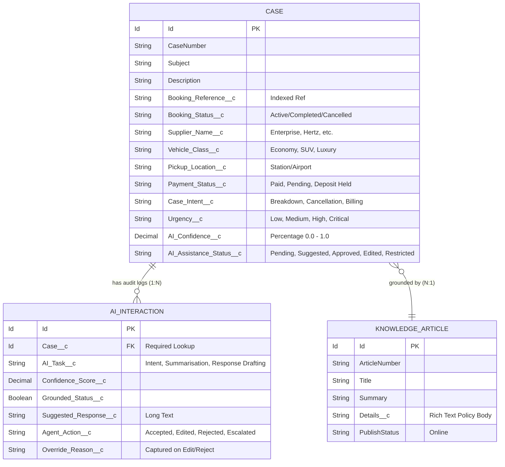

# 🏛️ Technical Architecture Specification

## 1. System Overview & Topology

The **AI-Assisted Case Management System** is engineered as a hybrid cloud architecture combining Salesforce Service Cloud with external reservation and fleet management backends.

```
                         ┌────────────────────────────────────────┐
                         │       Omni-Channel Customer Influx     │
                         │    (Email, Web-to-Case, WhatsApp)      │
                         └───────────────────┬────────────────────┘
                                             │
                                             ▼
┌────────────────────────────────────────────────────────────────────────────────────────┐
│                                 SALESFORCE CORE PLATFORM                               │
│                                                                                        │
│  ┌───────────────────────────────┐               ┌──────────────────────────────────┐  │
│  │   Case Initial Triage Flow    │──────────────▶│ BookingIntegrationQueueable (Job)│  │
│  │   (Record-Triggered Flow)     │               └────────────────┬─────────────────┘  │
│  └───────────────┬───────────────┘                                │                    │
│                  │                                       HTTP Callout (REST)           │
│                  ▼                                                │                    │
│  ┌───────────────────────────────┐                                ▼                    │
│  │    AIInteractionService       │               ┌──────────────────────────────────┐  │
│  │    (Intent, Grounding, Safety)│               │    BookingIntegrationService     │  │
│  └───────┬───────────────▲───────┘               └────────────────┬─────────────────┘  │
│          │               │                                        │                    │
│          ▼               │ Grounding SOQL                         ▼                    │
│  ┌────────────────┐  ┌───┴───────────────┐               ┌──────────────────┐          │
│  │AI_Interaction__c│  │  Knowledge__kav   │               │   Case Record    │          │
│  │  (Audit Logs)  │  │(Published Articles│               │  (Custom Fields) │          │
│  └────────────────┘  └───────────────────┘               └────────▲─────────┘          │
│                                                                   │                    │
│  ┌────────────────────────────────────────────────────────────────┴─────────────────┐  │
│  │                             caseAgentAssist (LWC Console)                        │  │
│  │       • Live Booking Context  • Grounded AI Draft  • Safety Guardrail Alerts     │  │
│  │       • Human-in-the-loop: Approve / Edit (with Override Reason) / Escalate      │  │
│  └──────────────────────────────────────────────────────────────────────────────────┘  │
└───────────────────────────────────────────▲────────────────────────────────────────────┘
                                            │
                                  JSON / REST Callouts
                                            │
                                            ▼
                         ┌────────────────────────────────────────┐
                         │        External Car Rental API         │
                         │    (Node.js / Express Reservation API)  │
                         │         GET /api/v1/bookings/:ref      │
                         └────────────────────────────────────────┘
```

---

## 2. Data Models & Entity Relationship



---

## 3. Integration Contracts (Booking REST API)

### Endpoint Specification
- **Method**: `GET`
- **Path**: `/api/v1/bookings/{bookingReference}`
- **Headers**:
  - `Accept: application/json`
  - `Authorization: Bearer <TOKEN>` (Mock: `Bearer test-token-123`)

### Sample Response: 200 OK
```json
{
  "status": "success",
  "data": {
    "bookingReference": "BK-7821",
    "status": "CONFIRMED",
    "customer": {
      "name": "Sarah Jenkins",
      "email": "sarah.j@example.com",
      "phone": "+44 7700 900077"
    },
    "vehicle": {
      "category": "Compact SUV",
      "model": "Nissan Qashqai",
      "registration": "LL21 XAB"
    },
    "supplier": {
      "name": "Europcar UK",
      "branch": "London Heathrow Airport Terminal 5"
    },
    "itinerary": {
      "pickupDateTime": "2026-09-15T10:00:00Z",
      "returnDateTime": "2026-09-22T10:00:00Z"
    },
    "financials": {
      "totalAmount": 340.00,
      "currency": "GBP",
      "paymentStatus": "PAID",
      "depositAmount": 250.00
    }
  }
}
```

### Error Responses
- `404 Not Found`: Unknown booking reference.
- `500 Internal Server Error`: Downstream supplier system unavailable.
- `400 Bad Request`: Malformed or missing booking reference parameter.

---

## 4. Grounding & Guardrail Logic Specifications

### Grounding Retrieval Engine
Every AI recommendation queries the `Knowledge__kav` object (`PublishStatus = 'Online'`) dynamically based on the classified intent:

| Detected Intent | Grounding Keyword Search | Primary Article Title |
| :--- | :--- | :--- |
| **`Vehicle Breakdown`** | `%Breakdown%` | 24/7 Roadside Assistance & Emergency Protocol |
| **`Cancellation`** | `%Cancellation%` | Booking Cancellation & Tiered Refund Policy |
| **`Billing`** | `%Billing%` | Security Deposit & Pre-Authorization Guidelines |
| **`Booking Change`** | `%Change%` | Modifying Dates, Vehicle Class & Additional Drivers |
| **`General Enquiry`** | `%Pickup%` | Rental Station Pickup & Identification Requirements |

### Safety & Guardrail Rules
The guardrail engine operates synchronously prior to draft generation. If triggered, **draft generation is suppressed (`suggestedResponse = null`)**, and the case status is immediately set to `Restricted`:

1. **Legal Risk Guardrail**:
   - *Keywords*: `lawyer`, `attorney`, `legal action`, `sue`, `lawsuit`, `court`, `solicitor`, `litigation`, `ombudsman`.
   - *Action*: Suppress draft, escalate urgency to `Critical`, alert agent to route to Legal.
2. **Safety Emergency Guardrail**:
   - *Keywords*: `injury`, `injured`, `hospital`, `ambulance`, `police`, `casualty`, `blood`, `crash`, `fatal`.
   - *Action*: Suppress draft, escalate urgency to `Critical`, surface emergency protocols.
3. **Fraud & Chargeback Guardrail**:
   - *Keywords*: `fraud`, `scam`, `unauthorized charge`, `stolen card`, `identity theft`, `chargeback`.
   - *Action*: Suppress draft, escalate to Billing Security Investigation team.
4. **Confidence Threshold Gate**:
   - *Rule*: Model confidence score `< 0.60`.
   - *Action*: Restrict auto-drafting to prevent low-certainty hallucinations.

---

## 5. Security & Access Control (PoLP Matrix)

| Component | Profile/PermSet | Permissions | Rationale |
| :--- | :--- | :--- | :--- |
| `Case` | `Case_AI_Support_Agent` | Read, Create, Edit | Frontline support operations |
| `AI_Interaction__c` | `Case_AI_Support_Agent` | Read, Create, Edit (No Delete) | Immutable audit trail & compliance |
| `Knowledge__kav` | `Case_AI_Support_Agent` | Read Only | Policy retrieval without authoring rights |
| Apex Classes (5) | `Case_AI_Support_Agent` | Enabled (`true`) | Secure controller and service execution |
